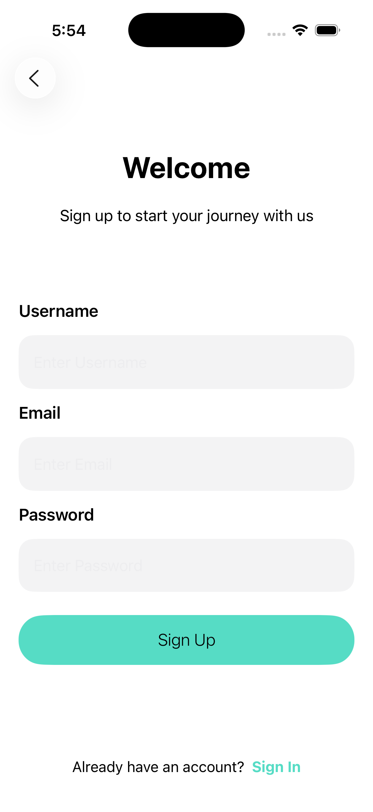
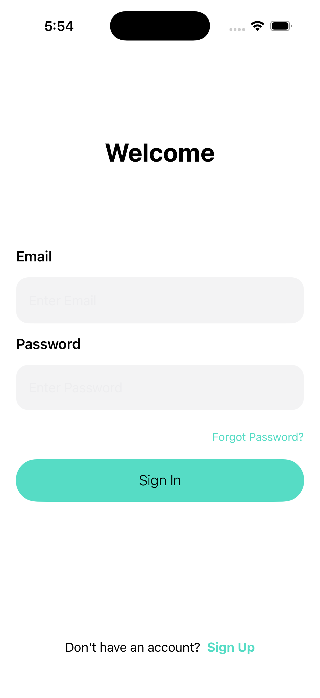
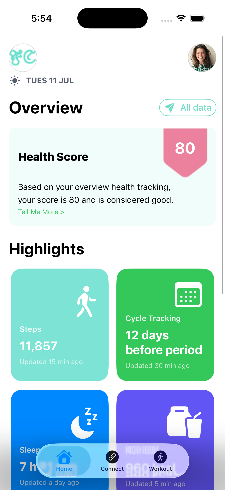
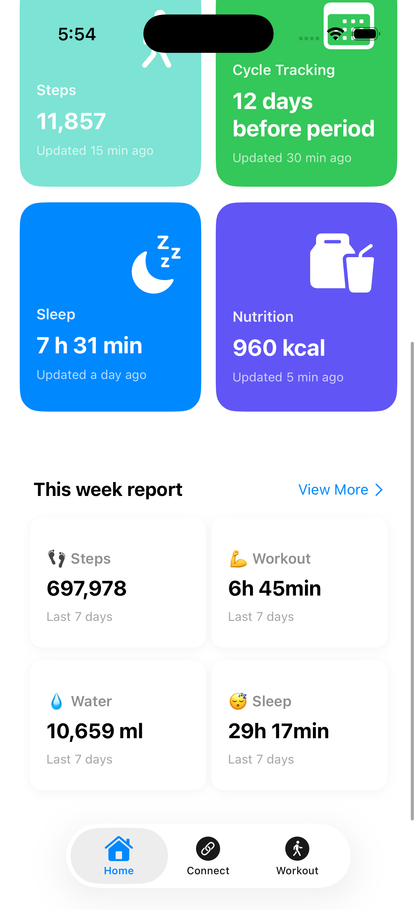

## ✨ Features

- User Authentication
- SwiftUI + MVVM Architecture
- REST API Integration
- Health & Fitness Tracking
- Weekly Progress Reports
- Dashboard Analytics
- Reusable Components
- Clean Architecture Principles

 <h2 align="center">📱 Application Screenshots</h2>

  
  

  
  

  

## 🏗️ Architecture

MVVM (Model-View-ViewModel)

Views
 ↓
ViewModels
 ↓
Services
 ↓
API Layer

## 🚀 Future Improvements

- Apple HealthKit Integration
- Push Notifications
- Offline Data Caching
- Workout Recommendation Engine
- AI-powered Fitness Insights
